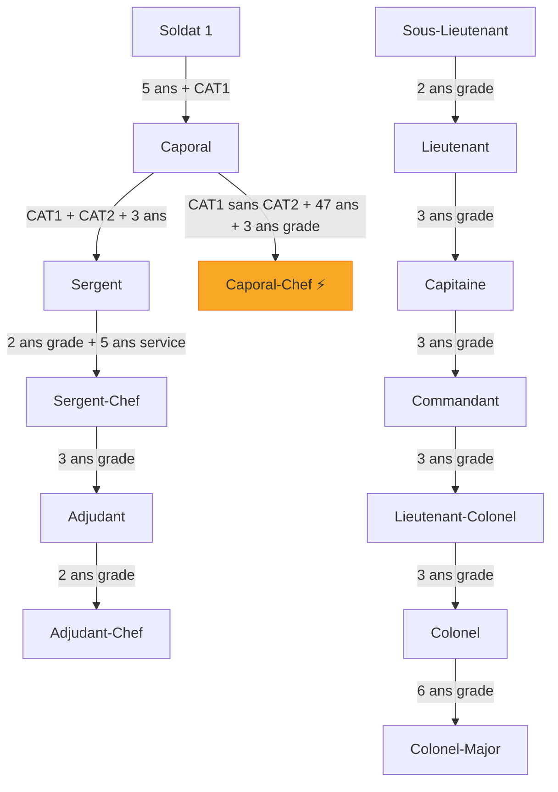

# Conditions d'Avancement de Grade — Système Actuel

## Conditions de base (communes à toutes les promotions sous-officiers)
- ❌ Pas de problème **disciplinaire**
- ❌ Pas de problème **judiciaire**
- ❌ Pas **déserteur**
- 📋 Statut **actif**

---

## Sous-Officiers

### Soldat 1 → Caporal
| Critère | Condition |
|---|---|
| Ancienneté de service | ≥ **5 ans** (depuis la date d'entrée en service) |
| Certificat requis | **CAT1** (Certificat d'Aptitude Technique Niveau 1) |
| Conditions de base | ✅ |

### Caporal → Sergent
| Critère | Condition |
|---|---|
| Certificats requis | **CAT1** + **CAT2** (les deux) |
| Ancienneté dans le certificat | 3 ans après obtention du CAT1 |
| Conditions de base | ✅ |

### Caporal → Caporal-Chef *(voie alternative)*
| Critère | Condition |
|---|---|
| Certificat requis | **CAT1** obtenu |
| Certificat **NON** obtenu | **CAT2** (n'a pas le CAT2) |
| Âge minimum | ≥ **47 ans** |
| Ancienneté dans le grade | ≥ **3 ans** comme Caporal |
| Conditions de base | ✅ |

> [!NOTE]
> C'est une voie de sortie honorable pour les Caporaux qui n'ont pas réussi à obtenir le CAT2 et qui ont atteint 47 ans.

### Sergent → Sergent-Chef
| Critère | Condition |
|---|---|
| Ancienneté dans le grade | ≥ **2 ans** comme Sergent |
| Ancienneté de service | ≥ **5 ans** |
| Conditions de base | ✅ |

### Sergent-Chef → Adjudant
| Critère | Condition |
|---|---|
| Ancienneté dans le grade | ≥ **3 ans** comme Sergent-Chef |
| Conditions de base | ✅ |

### Adjudant → Adjudant-Chef
| Critère | Condition |
|---|---|
| Ancienneté dans le grade | ≥ **2 ans** comme Adjudant |
| Conditions de base | ✅ |

---

## Officiers

### Sous-Lieutenant → Lieutenant
| Critère | Condition |
|---|---|
| Ancienneté dans le grade | ≥ **2 ans** comme Sous-lieutenant |

### Lieutenant → Capitaine
| Critère | Condition |
|---|---|
| Ancienneté dans le grade | ≥ **3 ans** comme Lieutenant |

### Capitaine → Commandant
| Critère | Condition |
|---|---|
| Ancienneté dans le grade | ≥ **3 ans** comme Capitaine |

### Commandant → Lieutenant-Colonel
| Critère | Condition |
|---|---|
| Ancienneté dans le grade | ≥ **3 ans** comme Commandant |

### Lieutenant-Colonel → Colonel
| Critère | Condition |
|---|---|
| Ancienneté dans le grade | ≥ **3 ans** comme Lieutenant-colonel |

### Colonel → Colonel-Major
| Critère | Condition |
|---|---|
| Ancienneté dans le grade | ≥ **6 ans** comme Colonel |

---

## Résumé visuel de la hiérarchie

> [!IMPORTANT]
> **Calcul de la date d'ancienneté :**
> - Pour Soldat 1 → Caporal : basé sur la **date d'entrée en service** + 5 ans
> - Pour tous les autres grades : basé sur la **date de dernière promotion** + X ans
